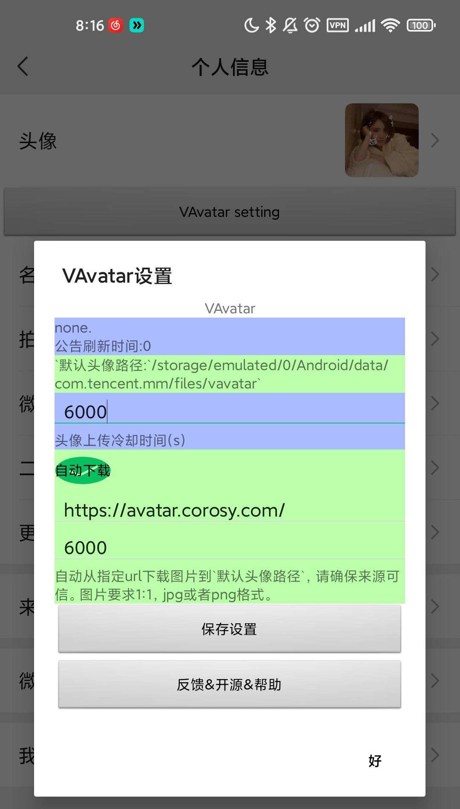

<h1>VAvatar</h1>
<h2>自动更换微信头像</h2>

  
  

## 适用版本
8.0.47、8.0.48、8.0.49、~~8.0.50~~、8.0.51、8.0.53、8.0.54、8.0.55

不支持`8.0.50` ！

8.0.46或许有效，但由于我无法登陆旧版本，未能进行验证。

> 强调：vx每次发布都会混淆，如果你的vx版本号正确，Vavatar却不能工作，请查看[额外说明](https://github.com/NoonieBao/VAvatar?tab=readme-ov-file#%E7%89%88%E6%9C%AC%E8%AF%B4%E6%98%8E)

## 头像源url
- `https://avatar.corosy.com/` 【默认使用】
- `https://uglyavatar.corosy.com`

> https://avatar.corosy.com/ 可以返回一张**远古的潮流头像**
> 
> https://uglyavatar.corosy.com/ 可以返回一张**丑陋头像**。丑陋头像的生成依赖于[txstc55](https://github.com/txstc55)的项目[ugly-avatar](https://github.com/txstc55/ugly-avatar)

## 用法

- Vavatar总是尝试从上传`默认头像路径`的图片到用户头像 （这个`默认头像路径`会被打印在Vavatar的设置界面）。

- 可以手动拷贝 1:1 的 jpg或png到`默认头像路径`，但请设置正确权限（如660）。

- Vavatar提供了`自动下载`头像功能，填入相应头像源url即可。亦可自己构建远程头像源，总之，确保直填入可信的URL。自动下载功能默认禁用，可手动开启。

- Vavatar的上传和下载受到冷却时间控制，可以设置相应的冷却时间。

## Vavatar设置入口

# 触发时机
`com.tencent.mm.ui.LauncherUI#onResume()`方法执行时。

即：每次**启动打开vx主界面或切屏回到vx主界面**会执行Vavatar的逻辑。

## 测试列表：

在这些环境下通过测试：

| phone        | API        |lsposed_api| os              | VX_version          |
| ------------ | ---------- | ---------- | --------------- | ------------------ |
| Mi 10 Ultra  | Android 11  |1.9.2(7024)| MIUI12.5 12.5.10 | 8.0.48          |
| Xiaomi Note3 | Android 11 |1.9.2(7024)| crDroid 7.21    | 上述所有版本 |

## 源代码

[源代码仓库 https://github.com/NoonieBao/vavatar](https://github.com/NoonieBao/vavatar)

接受建议和反馈。